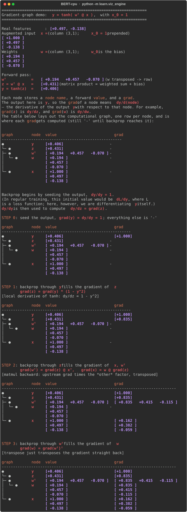

# BERT-CPU

> *"What I cannot create, I do not understand."*  
> — Richard Feynman

This project is built in that spirit: the surest way to understand BERT is to
build it from scratch. Here, *from scratch* is meant literally — **NumPy is the
only dependency, used only as an array computation backend**.

## What is BERT-cpu?

BERT-cpu is a NumPy-only, CPU-only environment for learning how a BERT-style
model is built and trained *from the autograd level up* — no GPUs, no CUDA, no
heavyweight framework. It favours **clarity, reproducibility and
inspectability** over raw performance. **Our engine is deliberately not meant to compete with PyTorch, TensorFlow, JAX or any other Deep Learning framework**.

Its real strength is that it makes the **learning machinery visible**. For
example, the didactic walkthrough turns the autograd engine inside out: it draws
the computational graph **vertically, the way `git log --graph` stacks commits**
(output on top, operands below), shows every node's forward value, then
**animates backpropagation step by step** — filling in each gradient with the
exact chain-rule formula used, all the way from the output seed back to the
inputs. The maths of training a network stops being a black box and becomes
something you can read line by line:



The same drawing scales up unchanged: a single `wᵀ @ x` op, or a whole stack of
`Linear` layers — it is always *a bigger graph of the same kind* (run
`python -m learn.viz02_nn` to see three activated layers chained together).

## Who is it for?

### For students

- **A democratic way to learn the maths.** See the full mathematics of training
  a network on any laptop — no GPU, CUDA, or cloud budget required. **The barrier to understanding deep learning becomes curiosity, not expensive hardware: the maths is the point, the hardware is not**.
- Study how a network is differentiated **from first principles**, seeing how a   `Tensor` stores its value, gradient, parent nodes, op label, and local   backward function.
- Watch the **computational graph** get built during the forward pass, and flow backward, one node at a time, with the chain-rule formula shown at each step.
- Connect mathematical formulas directly to executable NumPy code.

### For teaching

- Use the step-by-step walkthrough as a lecture artifact for courses on
  automatic differentiation, deep-learning fundamentals, and (as the higher
  layers land) Transformer models.
- Demonstrate each engine operation independently before assembling larger
  computations.
- Build exercises where students modify a single op or backward rule and
  immediately observe the effect on the gradients.
- Debug student implementations by comparing **analytic vs numerical**
  gradients.
- Choose the precision and RNG seed of the demo on the command line, so the
  same walkthrough can be shown under different settings
  (`python -m learn.viz01_engine --precision float32 --seed 0`).

### For researchers

- Validate that an idea is **mathematically and computationally sound** in a
  transparent setting before investing in a large-scale implementation.
- **Reproducibility:** one global seed (`bert_cpu.set_seed(0)`) makes a whole run
  repeatable end to end, with far fewer sources of randomness than large-scale
  GPU training.
- **Minimal stack:** only NumPy — no CUDA versions, GPU kernels, or distributed
  setup to reproduce, so experiments are easy to replicate on common hardware.
  Skip the infrastructure tax. Test fundamental "first-principles" hypotheses
  (e.g., alternative credit assignment, sparse topologies) instantly on **any machine**,
  without managing CUDA toolkits, dependency hell, or cluster allocations.
- **Full inspectability:** the entire computational path (values *and*
  gradients) is visible, which makes failures and learning dynamics easy to
  examine in small, controlled toy settings.
- **Precision control:** run the engine in float64 (stable, default) or
  float32/float16 to study the numerical behaviour of an idea.

## Requirements

- Python >= 3.8
- NumPy (the only runtime dependency)

## Setup

Create a virtual environment and install the dependencies:

```bash
# Create the virtual environment
python3 -m venv .venv

# Activate it
source .venv/bin/activate        # Linux / macOS
# .venv\Scripts\activate         # Windows (PowerShell)

# Install the dependencies
pip install --upgrade pip
pip install -r requirements.txt
```

> **Note:** if `python3 -m venv` fails with an `ensurepip is not available`
> error, your interpreter is missing the `venv` module. On Debian/Ubuntu install
> it with `apt install python3-venv`, or use a `pyenv`-managed Python.

### Check the install

```bash
pytest test/test_engine.py test/test_nn.py     # the parts you will actually use
```

Everything there should pass. A full `pytest` also runs `test/test_model.py`, which
**fails on purpose**: attention and the Transformer encoder are the parts of the library
that are still scaffolding, so their four tests raise `NotImplementedError`. Four failures
in `test_model.py` mean your install is fine; anything else does not.

## Learning path (start here)

This project is meant to be *read and run* from the ground up. Everything BERT does
eventually reduces to one idea: a graph of tensor operations through which gradients flow
backward. The three packages take you through that idea three times, each time asking more
of you — and a practical course walks them in this order:

| package | what you do there | how long |
|---|---|---|
| **`learn/`** | **Watch.** Terminal walkthroughs that draw the computational graph and animate the backward pass, node by node | one sitting |
| **`exercises/`** | **Write.** Six notebooks: a new op and its derivative, layers built from engine ops, then two models actually trained on real data | q01–q04 an afternoon each; q05–q06 one session |
| **`research/`** | **Investigate.** Pick one of fifteen open questions and measure whether an idea from the literature buys accuracy for its FLOPs | 2–5 days |

Nothing here needs a GPU, an account, or a download: the whole path runs on the laptop you
installed it on.

### Step 1 — watch the gradient engine

The didactic visualisations live in the `learn/` package and are run as modules from the
project root (use `-m` so `bert_cpu` is importable — running the file by path is not).
With the virtual environment activated:

```bash
python -m learn.viz01_engine
```

This standalone run also lets you choose the numerical precision and the RNG seed, so you
can watch the same walkthrough under different settings and get reproducible numbers:

```bash
python -m learn.viz01_engine --precision float32 --seed 0
python -m learn.viz01_engine --precision float16 --seed 42
```

- `--precision` picks the engine's float dtype (`float16` / `float32` / `float64`;
  default `float64`).
- `--seed` seeds NumPy's RNG so the run is reproducible (omit for a random run).

What you will see, and what to take away from it:

1. **An input column vector** `x` and a **weight column vector** `w`. The demo
   uses the "bias trick": the input is *augmented* with a leading constant
   `x_0 = 1`, so `w_0` plays the role of the bias.
2. **The forward pass** of a tiny linear layer, computing `z = wᵀ @ x` (a matrix
   multiplication) and then `y = tanh(z)`, step by step.
3. **The computational graph as a vertical tree** (output on top, operands
   hanging below with `git`-style connectors), each node annotated with its
   forward `value` and its `grad` — column vectors and matrices drawn in their
   mathematical shape.
4. **The backward pass, animated step by step.** Each step fills in one node's
   gradient and prints the local derivative rule it used (for the `tanh`, the
   matmul `@`, and the transpose), so you watch the chain rule propagate from
   the output seed back to every input.

Read the graph from the top down to follow the forward pass, then read the
gradients to see how `backward()` distributes the chain rule from the output
back to every input.

### Step 2 — watch a layer, and how stacking layers chains derivatives

Once the engine clicks, move up one level to the `nn` layers:

```bash
python -m learn.viz02_nn --seed 5      # seed 5 keeps every ReLU unit lively
```

This walkthrough shows that a `Linear` layer is **just a matrix** (with the bias
folded into row 0 via the same `x_0 = 1` trick), then a nonlinearity; and that
**stacking three activated layers turns the backward pass into a chain of
derivatives**, propagated layer by layer and multiplied at each step by the
activation slope `act'(z)` and the weight matrix. The rest of the library
(attention, the full encoder) is just *bigger graphs of the same kind*.

### Step 3 — write the pieces yourself

Now stop watching. The first four notebooks in `exercises/` hand you a blank `forward` (or,
in Exercise 01, a blank `_backward`) and a grading cell that checks your gradients against
finite differences:

```bash
pip install jupyterlab matplotlib     # not runtime dependencies; only the exercises need them
jupyter lab                           # then open exercises/q01_activations.ipynb
```

- **q01** — add `sigmoid`, `swish` and `softplus` to the engine as new ops, writing the
  local derivative by hand. This is the only exercise where you write a backward pass.
- **q02–q04** — build layers by *composing* ops the engine already differentiates (the star
  operation, the GLU family, learned mixtures of activations), and watch the engine produce
  their gradients for free.

A PASS means your analytic gradient matched a numerical one to about `1e-9`. Unfinished
pieces report `SKIPPED`, so a half-done notebook still grades the parts you did. Details in
[Exercises (Jupyter notebooks)](#exercises-jupyter-notebooks).

### Step 4 — train something real

The last two notebooks are complete — nothing to fill in — because their job is to show the
whole pipeline at once, with the maths beside the code:

- **q05** — an MLP that classifies UCI Adult income: softmax, cross entropy, Adam, a
  train/validation split, and the FLOPs it all cost. This is the first time the pieces
  become a model that learns (~8 s to run).
- **q06** — word2vec on the *Flatland* corpus: embeddings learned from raw text with no
  labels at all, scored before and after training (~1.5 min).

### Step 5 — investigate

Finally, `research/01_research_questions.ipynb` turns the engine into an instrument. Fifteen
open questions, each with the papers to read first; you pick **one** and spend two to five
days answering it experimentally, measuring **accuracy per FLOP** against the q05/q06
baselines. See [Research project](#research-project-pick-one-question).

The full testing reference is in
[Tests and didactic walkthroughs](#tests-and-didactic-walkthroughs).

## Usage

With the virtual environment activated, import the library from the project
root. The package directory is `bert_cpu` (underscore — the importable name),
while the distribution is named `bert-cpu`.

**The autograd engine.** Build an expression out of `Tensor`s and differentiate
it with `backward()`:

```python
from bert_cpu import engine as cpu

cpu.set_seed(0)                        # reproducible run

x = cpu.Tensor([[2.0], [-3.0]])        # input column vector (2, 1)
w = cpu.Tensor([[0.5], [1.5]])         # weight column vector (2, 1)
y = (w.T @ x).tanh()                   # forward pass: a tiny linear unit

y.backward()                           # reverse-mode autodiff
print(x.grad, w.grad)                  # gradients dy/dx, dy/dw
```

**An `nn.Linear` layer.** The first building block on top of the engine is in
place. It uses the column-vector "bias trick" (input augmented with `x_0 = 1`,
bias folded into row 0 of the weight), so a layer is just `Wᵀ @ x`:

```python
from bert_cpu import engine as cpu, nn

cpu.set_seed(0)

x = cpu.Tensor([[2.0], [-3.0]])        # input column vector (in_features, batch)
layer = nn.Linear(2, 4)                # weight is (in_features + 1, out_features)
y = layer(x).relu()                    # forward: relu(Wᵀ @ [1; x])

y.sum().backward()                     # gradients flow into layer.weight
print(layer.weight.grad)               # dL/dW (bias row included)
```

> Optimizers (`optim.SGD`, `optim.Adam`), the loss (`loss.cross_entropy`) and the
> WordPiece `tokenizer` are implemented — Exercises 05 and 06 train with them. What is
> still scaffolding: `MultiHeadAttention`, the Transformer encoder and `BERTModel`, plus
> `nn.LayerNorm`, `nn.Dropout` and `nn.Sequential`. Their tests fail on purpose, and
> filling some of those stubs in is exactly what a couple of the research questions ask
> of you.

## Exercises (Jupyter notebooks)

The `exercises/` folder is where you stop reading and start writing. The six
exercises are **Jupyter notebooks**: the theory is rendered next to the code, you fill in
the blanks, and the cell below grades what you wrote by comparing the engine's gradients
with finite differences.

### Install the notebook dependencies

Jupyter is *not* a dependency of the library (`requirements.txt` stays NumPy-only) — it is
only how the exercises are delivered. With the virtual environment activated:

```bash
pip install jupyterlab matplotlib
```

`matplotlib` is optional: it is used by a single plotting cell in Exercise 01, which says
so and skips itself if the package is missing.

### Launch

Start Jupyter **from the project root** and open the first notebook:

```bash
jupyter lab                  # or: jupyter notebook
```

Then open `exercises/q01_activations.ipynb`. Opening the `.ipynb` files directly in VS Code
(or any other notebook editor) works just as well — the first cell of every notebook puts
the project root on `sys.path`, so `import bert_cpu` resolves whether the kernel starts in
the project root or inside `exercises/`.

### The six exercises, in order

| # | Notebook | What you build |
|---|---|---|
| 01 | `q01_activations.ipynb` | `sigmoid`, `swish`, `softplus` as **new engine ops** — forward *and* the hand-written `_backward` |
| 02 | `q02_rewrite_the_stars.ipynb` | The **star operation** (`act(u) * v`) as `nn.Module` layers — composed ops, so autograd writes the backward for you |
| 03 | `q03_gated_linear_units.ipynb` | The **GLU family** (GLU, GTU, bilinear, GEGLU, SwiGLU) |
| 04 | `q04_learnable_activations.ipynb` | A **learned mix** of ReLU/GELU/SiLU, with trainable coefficients |
| 05 | `q05_binary_classification.ipynb` | The first **trained** network: an MLP that classifies UCI Adult income (~8 s to run) |
| 06 | `q06_learn_embedding.ipynb` | **word2vec** on *Flatland* — skip-gram with negative sampling (~1.5 min to run) |

Work through them in that order — they build on each other. Exercise 03 asks you to bring
the `swish` you wrote in Exercise 01 over into one cell, so a passing SwiGLU check
validates both notebooks at once.

**01–04 are fill-in exercises**: you write a `forward` (or, in 01, a `_backward`) and a
grading cell checks it against finite differences. **05 and 06 are complete** — nothing to
fill in. They are where the pieces become a network that actually trains on real data, so
they read as guided walkthroughs: the maths next to the code, in the notation of the
*Neural Networks* lecture notes, with each section naming the part of the notes it puts to
work.

### How a notebook works

1. Run the **setup** cell at the top (imports and the `sys.path` bootstrap).
2. In 01–04, fill in each cell marked `# TODO:` — remove its `raise NotImplementedError`
   and write the forward pass. Everything under a **GIVEN** heading is the harness; leave
   it alone. In 05–06 there is nothing to fill in: read a section, run its cell, and check
   the claim it makes.
3. Run the **grading** cell. It prints, per tensor,
   `max|analytic - numeric|` — the difference between the gradient `backward()` produced
   and the same gradient recomputed by central finite differences. Anything around `1e-9`
   is a PASS; a large number means the forward (or, in Exercise 01, the derivative) is
   wrong. Unfinished pieces are reported as `SKIPPED`, so a half-finished notebook still
   grades the parts you did.

The checker itself lives in [`exercises/grading.py`](exercises/grading.py) — plain,
readable code that knows nothing about the engine internals, which is exactly why its
agreement is evidence.

### The two trained exercises

Exercises 05 and 06 are the ones that leave the toy setting: they load real data and run a
real training loop, so they cost more than a keystroke to run (~8 s and ~1.5 min
respectively, on CPU, in pure NumPy). Both are self-contained notebooks — run the cells top
to bottom.

- `q05_binary_classification.ipynb` — a `Linear -> ReLU -> Linear` classifier on **UCI
  Adult**, trained full-batch with Adam and softmax cross entropy. It is the first place the
  whole pipeline appears at once, and it checks its own claims: the softmax + cross-entropy
  gradient is verified against the formula, and the training/validation curves are plotted
  (needs `matplotlib`).
- `q06_learn_embedding.ipynb` — **word2vec** (skip-gram with negative sampling) over the
  *Flatland* corpus, learning an embedding table from raw text with no labels. It scores
  itself with a silhouette report over three word groups, printed before and after training.

## Research project (pick one question)

Once the exercises are done, `research/` turns the engine into an instrument. It holds
**fifteen open research questions** — the student picks **one** and spends two to five days
answering it experimentally, against the code this repository already contains.

```bash
jupyter lab                                  # then open:
research/01_research_questions.ipynb
```

They share one axis, the one the engine can measure about itself: **accuracy per FLOP**.
`bert_cpu/engine.py` counts the arithmetic it executes (`reset_flops()` / `flop_count()`),
so every question is a trade-off — *does this idea buy accuracy for its compute?* — rather
than the unanswerable *does this idea help?*. The themes span cheaper layers (low-rank,
ternary weights, sparsity, conditional compute), activations and gating (extending q02–q04),
losses and regularisation (focal and poly losses, R-Drop, mixup), optimisation (Lion, Muon,
equal-budget comparisons), and representation learning (distillation, data pruning,
contrastive pretraining, embedding-table shape). Each question comes with two to four
papers to read first, what to implement, the protocol to follow, and what two versus five
days of work looks like.

The notebook also carries the **experimental protocol** the answers share (three seeds
minimum, mean ± standard deviation, never a claim inside the error bars, FLOPs reported
beside every score), the **report template**, and the **grading rubric**.

`research/benchmark.py` is the measuring device:

```python
from research.benchmark import run_adult, baseline_mlp, repeat, summarize

def my_variant(n_features):        # ← your idea goes here: any nn.Module
    return baseline_mlp(n_features)

rows  = repeat(lambda s: run_adult(baseline_mlp, seed=s, name="baseline"))
rows += repeat(lambda s: run_adult(my_variant, seed=s, name="my variant"))
print(summarize(rows, baseline="baseline"))   # mean ± std, FLOPs, and the delta
```

It runs the q05 loop (or the q06 one, via `run_sgns`) and returns the score *with* its
training and inference FLOPs, so fifteen students answering fifteen different questions
produce tables that can be read side by side. It is checked against the notebooks it
mirrors: `run_adult(baseline_mlp, seed=0)` reproduces q05's 0.8543 test accuracy and its
84,227,782,200 training FLOPs exactly.

## Tests and didactic walkthroughs

The project keeps two concerns cleanly apart:

1. **Software tests** (`test/`) — ordinary correctness checks (broadcasting,
   matmul, softmax, finite-difference gradient checks, the layers, the
   cross-layer chain rule). These only assert; they do not teach.
2. **Didactic walkthroughs** (`learn/`) — runnable visualisations that *print to
   the console* to teach what is happening internally, e.g. drawing the
   computational graph and animating how reverse-mode autodiff propagates the
   chain rule from the output back to the inputs.

First install the test dependency (already covered if you ran the setup above):

```bash
pip install pytest
```

### Run the software tests

```bash
pytest test/test_engine.py test/test_nn.py   # the parts that are built — all pass
pytest                                       # everything, including the scaffolding
pytest -v                                    # verbose, one line per test
pytest test/test_viz.py                      # smoke-check the learn/ walkthroughs
```

A bare `pytest` reports **four failures in `test/test_model.py`**, and that is the correct
result today: `MultiHeadAttention`, the encoder layer and `BERTModel` are still stubs that
raise `NotImplementedError`, and those tests are waiting for them. Anything failing outside
`test_model.py` is a real problem.

### Run the didactic walkthroughs

The walkthroughs live in `learn/` and are run as modules from the project root
(use `-m` so `bert_cpu` is importable, not by path):

```bash
python -m learn.viz01_engine                               # autograd engine, node by node
python -m learn.viz01_engine --precision float32 --seed 0  # pick dtype and seed
python -m learn.viz02_nn --seed 5                           # a layer + the chain rule over a stack
```

- `viz01_engine` — input vector → forward pass → ASCII graph annotated with
  gradients → step-by-step backward animation.
- `viz02_nn` — a `Linear` layer as a matrix, then three activated layers whose
  backward pass is shown as a layer-by-layer chain of derivatives.

Both accept `--precision` and `--seed`. (A lightweight `pytest test/test_viz.py`
just smoke-checks that the walkthroughs still run.)

> New here? Follow the [Learning path](#learning-path-start-here) above — it
> walks you through the engine demo first, since every other module is built
> on top of it.
